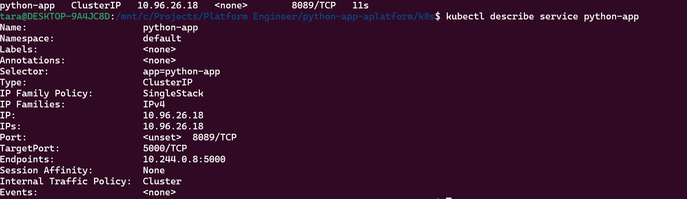

wsl -d Ubuntu
1. Download http://kind.sigs.k8s.io/ its a k8s locally
  1. go to website and then user installation instructions or  https://kind.sigs.k8s.io/docs/user/quick-start
  2. for linux uname -m 
  3. curl.exe -Lo kind-windows-amd64.exe https://kind.sigs.k8s.io/dl/v0.30.0/kind-windows-amd64
  4. for windows 
       41. Move-Item .\kind-windows-amd64.exe "C:\Program Files\Kind\kind.exe"
       42. "C:\Program Files\Kind" | Get-ChildItem - verify it works
       43. set env var setx PATH "$($env:PATH);C:\Program Files\Kind"
  5. for linux chmod +x ./kind
  6. for linux move it to binary dir sudo mv ./kind /usr/local/bin/kind
2. continue with linux 
3. Create cluster
  31. https://kind.sigs.k8s.io/
  32. kind create cluster 
  33. docker ps
  
4. connect to k8s
  41. donwload kubectl https://kubernetes.io/docs/tasks/tools/ -> https://kubernetes.io/docs/tasks/tools/install-kubectl-linux/
       curl -LO "https://dl.k8s.io/release/$(curl -L -s https://dl.k8s.io/release/stable.txt)/bin/linux/amd64/kubectl"
  42. download kubectl binary 
  43. ll - outout kubectl
  44. chmod +x kubectl -> give executable permissions
  45. move it to binary folder so we can use it like kubectl
      sudo mv ./kubectl /usr/local/bin/kubectl
      kubectl version
      kubectl get pods
      kubectl cluster-info
      docker ps to seee the cluster
      kubectl get ns

5. Configure ingress
  51.  https://kind.sigs.k8s.io/docs/user/ingress/ 
  52.  delete existing cluster kind delete cluster
  53.  install the cluster with port 80 and 443 
          cat <<EOF | kind create cluster --config=-
               kind: Cluster
               apiVersion: kind.x-k8s.io/v1alpha4
               nodes:
               - role: control-plane
               extraPortMappings:
               - containerPort: 80
               hostPort: 80
               protocol: TCP
               - containerPort: 443
               hostPort: 443
               protocol: TCP
          EOF
  54. kubectl apply -f https://kind.sigs.k8s.io/examples/ingress/deploy-ingress-nginx.yaml
       kubectl get ns
       kubectl get all -n ingress-nginx
       kubectl get pods -n ingress-nginx
6. Deploy app
  61. kubectl apply -f deploy.yaml
  62. kubectl get deployments
  63. kubectl get pods
  64. Expose app
       641. create service
       642. kubectl apply -f service.yaml
            kubectl get service
            kubectl describe service python-app
            
       643. create ingress
       644. get ingressclass 
          kubectl get ingressclass
          kubectl apply -f ingress.yaml
          kubectl get ingress

