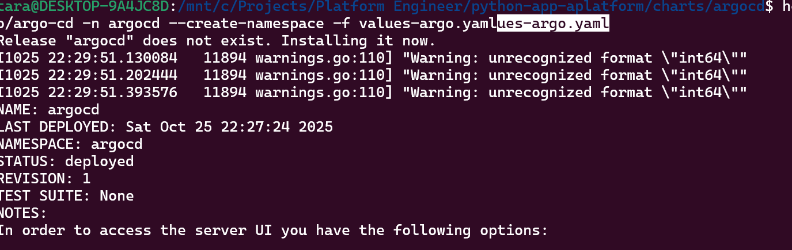

We are going to install argocd with helm into k8s
# install argo
1. Go to google -> argo cd install helm -> https://argo-cd.readthedocs.io/en/stable/operator-manual/installation/
2. Go to Helm section and click on argo-helm/charts/argo-cd - > https://github.com/argoproj/argo-helm/tree/main/charts/argo-cd
3. prerequisites are to have helm and to add the repo
     helm repo add argo https://argoproj.github.io/argo-helm
     argo has been added to your repos

4. after that do helm repo ls
     NAME    URL
     argo    https://argoproj.github.io/argo-helm
5. Install the argo cd release
     helm install my-release argo/argo-cd
6. Go to charts create argocd folder and values-argo.yaml
7. update the file like redis-ha which is highavailability which we do not want to false -> check HA mode without autoscaling
8. something else we wannt to to is to deal with ingress go to Ingress Configuration -> https://github.com/argoproj/argo-helm/tree/main/charts/argo-cd#ingress-configuration
9. Copy the example and pat it in the values-argo -> make sure identation is correct
10. Save it and go to the project -> /mnt/c/Projects/Platform Engineer/python-app-aplatform/charts/argocd
11. Install the chart
     1. go to the docs -> Installing the Chart
     2. helm upgrade --install argocd argo/argo-cd -n argocd --create-namespace -f values-argo.yaml
     3. wait for a while
          
     4. kubectl get ns
     5. kubectl get pods -n argocd
     6. kubectl get ing -n argocd
          add 127.0.0.1 argocd.test.com
     7. kubectl get svc -n argocd

12. Google for nginx ingress https backend -> https://stackoverflow.com/questions/54459015/how-to-configure-ingress-to-direct-traffic-to-an-https-backend-using-https 
     1. add this to ingress in values-argo
     2. kubectl get ing -n argocd -o yaml
13. go to argocd.test.com
     1. kubectl get pods -n argocd
     2. get argocd-server-7545bf756d-c6lkr
     3. Initial passwrod is in secret in same namespace
          1. kubectl get secrets -n argocd
          2. argocd-initial-admin-secret
          3. kubectl get secrets -n argocd argocd-initial-admin-secret -o yaml
          4. WGRrY2NFYVZ3WHhNaE85QQ==
          5. decode it -> echo "WGRrY2NFYVZ3WHhNaE85QQ==" | base64 -d
          6. XdkccEaVwXxMhO9A
          7. user is admin
          8. go to argocd.test.com and put user and password
     4. 
# github
